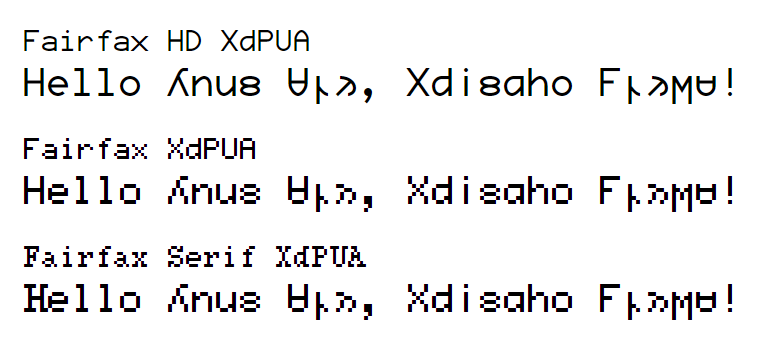

# Fairfax XdPUA

<picture>
  <source media="(prefers-color-scheme: dark)" srcset="images/preview-dark.png">
  
</picture>

Kreative Software 的 [Fairfax]、[Fairfax HD] 字体[希顶字母 PUA 编码][XdPUA]版。\
Modified version of the [Fairfax] and [Fairfax HD] fonts by Kreative Software that supports the [Shidinn Alphabet PUA Encoding(zh)][XdPUA].

删去了除 uF800 和希顶文区段外的所有私用区字符，并在基本多文种平面私人使用区中为希顶字符分配了等价的代码点。\
All Private Use Area glyphs except uF800 and the Shidinn block are removed. Shidinn characters are then given alternate codepoints in the Basic Multilingual Plane Private Use Area.

[原版字体的 GitHub 仓库\
Original GitHub repository of the fonts][open-relay]

[fairfax]: https://www.kreativekorp.com/software/fonts/fairfax/
[fairfax hd]: https://www.kreativekorp.com/software/fonts/fairfaxhd/
[XdPUA]: https://wiki.xdi8.top/wiki/希顶字母PUA编码
[open-relay]: https://github.com/kreativekorp/open-relay

## 选择版本 Which version to download

### 变体 Variants

<table>
<thead>
<tr>
<th scope='row'>基本名称 Base name</th>
<th scope='row'>说明 Explanation</th>
</tr>
</thead>
<tbody>
<tr>
<td>FairfaxHD</th>
<td>标准 standard</td>
</tr>
<tr>
<td>Fairfax</th>
<td>像素 pixelated</td>
</tr>
<tr>
<td>FairfaxSMHD</th>
<td>严格等宽 strictly monospaced</td>
</tr>
<tr>
<td>FairfaxSM</th>
<td>严格等宽，像素 strictly monospaced, pixelated</td>
</tr>
<tr>
<td>FairfaxSerif</th>
<td>衬线，像素 serif, pixelated</td>
</tr>
<tr>
<td>FairfaxSerifSM</th>
<td>衬线，严格等宽，像素 serif, strictly monospaced, pixelated</td>
</tr>
</tbody>
</table>

在衬线版中，希顶字符并没有衬线，只有普通字符有。\
Shidinn charactes do not have serifs in the serif versions, only regular characters do.

严格等宽版本删去了所有宽度与基本 ASCII 不同的字符，包括结合字符、全角字符和希顶汉字。一般来说您**不应该**使用这些版本。\
The strictly monospaced versions have all characters not the same width as basic ASCII removed, including combinig characters, double-width characters and Shidinn Hanzi. Usually you **should not** use such versions.

### 编码 Encodings

<table>
<thead>
<tr>
<th scope='row'>名称后缀 Name suffix</th>
<th scope='row'>说明 Explanation</th>
</tr>
</thead>
<tbody>
<tr>
<td>XdPUA</th>
<td>希顶字母 PUA 编码（旧） Shidinn Alphabet PUA Encoding (Legacy)</td>
</tr>
<tr>
<td>Xdi8</th>
<td>实验性：希顶协调码（仅部分支持） experimantal Shidinn Conventional Encoding (partial support only)</td>
</tr>
</tbody>
</table>

新希顶协调码遵照希顶字母新扩展推荐集制定，对于扩充希顶字母的编码与旧 PUA 编码不同。由于 FairFax 依照 UCSUR 编码制作，而 UCSUR 编码仅包含旧希顶字母 PUA 编码中包含的希顶字符，希顶协调码版字体仅支持两套编码中同时包含的字母，且仍使用旧扩充集的字母写法。\
The new Conventional Encoding is based on the new Set of Recommended Supplementary Shidinn Letters, suggesting different codepoints for supplementary letters than the old PUA Encoding. As Fairfax is based on the UCSUR, which only includes Shidinn letters that were in the old PUA Encoding, the new Conventional Encoding versions of this font only supports letters that are included in both encoding conventions, and still uses the letter shapes from the old supplementary letter set.

两种编码中基本字母和非字母字符的码位均相同。\
Codepoints for Basic Shidinn Letters and non-Shidinn-letter characters are the same in both encoding conventions.

### 格式 Formats

<table>
<thead>
<tr>
<th scope='row'>扩展名 Extension</th>
<th scope='row'>说明 Explanation</th>
</tr>
</thead>
<tbody>
<tr>
<td>.ttf</th>
<td>适合安装 Suitable for installing</td>
</tr>
<tr>
<td>.woff2</th>
<td>体积小，适合网页引用 Small size, suitable for websites</td>
</tr>
<tr>
<td>.woff</th>
<td>体积较小，适合网页引用时为旧浏览器提供回退 Relatively small size, suitable for websites as a fallback for old browsers</td>
</tr>
</tbody>
</table>

## 构建 Build

确保已安装 FontForge，然后运行以下命令。必要时在 `ffpython` 前添加路径。\
Make sure FontForge is installed, then run the following command. Prepend `ffpython` with path when necessary.

~~~shell
ffpython patch.fontforge.py input/*
~~~
